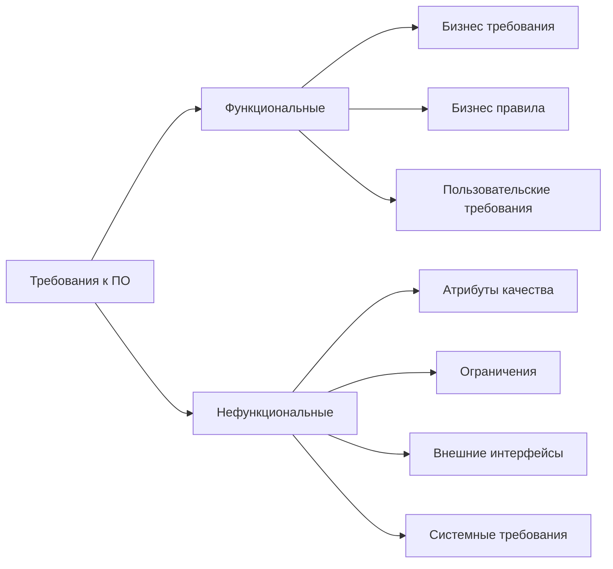

## Управление требованиями

Ниже перечислены темы, которые будут рассмотрены в рамках направления Управление требованиями.

### Оглавление:
1. Отличие Бизнес аналитика от Системного аналитика
2. Классификация требований
3. Критерии требований
4. Методы сбора требований
5. Жизненный цикл проекта/задачи
6. Модели жизненного цикла ИС
7. Методологии разработки ИС
8. Инструменты описания требований
9. Виды UML диаграмм
10. Виды BPMN диаграмм

1. Отличие Бизнес аналитика от Системного аналитика

   1.1. Разница в результатах работы

| Бизнес аналитик  | Системный аналитик                  |
|------------------|-------------------------------------|
| Отвечает на вопросы "ЧТО" ? | Отвечает на вопросы группы "КАК" ?  |
| Какие результаты хочет получить бизнес-заказчик: Что в результате? | Как изменить систему, чтобы получить результаты? |
| Каким способом он эти результаты планирует получить: Что будут делать в системе? | Как нужно настроить систему, чтобы пользователь смог выполнить нужный набор действий? |

1.2. Разница в типовых задачах, которые выполняют специалисты

| Бизнес аналитик                                                                                                       | Системный аналитик                                                      |
|-----------------------------------------------------------------------------------------------------------------------|-------------------------------------------------------------------------|
| 1. Интервью, интервью и еще раз интервью. Подготовка к интервью, проведение интервью и фиксация результатов интервью. | 1. Анализ и проектирование решения.                                     |
| 2. Подготовка и согласование проектов с бизнес-заказчиком                                                             | 2. Реализация решения No / Low Code                                     |
| Ключевое это общение с бизнесом и точная фиксация того, что узнали. Работает с людьми                                 | Ключевое - это анализ того, как реализовать в системе требуемый бизнес-процесс. Анализирует систему |

1.3. Разница в артефактах для проекта (продукта)

| Бизнес аналитик                                                                                                                                                                                                                                                                   | Системный аналитик                  |
|-----------------------------------------------------------------------------------------------------------------------------------------------------------------------------------------------------------------------------------------------------------------------------------|-------------------------------------|
| Документ, фиксирующий цели и метрики. Бизнес-требования - детальное описание процесса: схемы, описание каждого шага, сценарии использования. Прототипы (Figma) - актуально, когда процесс автоматизируется впервые, или если разлинчные варианты реализации. |	Проект решения - какием образом можно реализовать процесс, чтобы получить желаемые результаты. Постановка на разработку - какие изменения и кто в системе должен их делать. Настройка системы No/Low Code - изменения в системе через интерфейс.                                                                                                                                                                                                               |
|Senior: в 100% случаев выступает методологом - организует процесс сбора требований так, чтобы бизнес-заказчик смог четко сформулировать свое видение и образ результата. Актуально в тех случаях, когда процесс автоматизируется впервые - раньше работали в Excel и почте, а планируем в системе.	|Senior: в 100% случаев проектирует систему, продумывает риски связанные с вариантами реализации, определяет эффективный способ реализации с т.з. стабильной работы системы и соответствия бизнес-требованиям.|

1.4. Разница в знаниях и умениях

| Бизнес аналитик                                                                                                       | Системный аналитик                                                      |
|-----------------------------------------------------------------------------------------------------------------------|-------------------------------------------------------------------------|
|Проведение интервью для сбора требований	| Создание системных моделей – объективная модель, модель преобразований, UML|
|Создание реестра бизнес-процессов	|Подготовка постановок на разработку: документ с описанием, перечень объектов системы, каким образом нужно преобразовать|
|Описание бизнес-процессов в одном из стандартов: IDEF0, IDEF3, EPC, BPMN 2.0	| Настройка системы: Создание исполняемых бизнес процессов BPMN 2.0, бизнес правил, и другие No/Low Code настройки |
|Описание вариантов реализации: кейсы, сценарии использования| |
|Прототипирование| |

2. Классификация требований

### Функциональные требования

Функциональные требования — это описание того, каким потребностям бизнеса и/или пользователей должны соответствовать функции системы. Они определяют поведение системы при определённых входных данных и условиях.

**Отвечают на вопросы:** 
- Что делает система?
- Зачем система это делает?"

**Пример:** Система должна позволять регистрировать образцы с автоматической генерацией уникальных идентификаторов и штрих-кодов

#### Бизнес-требования (Business Requirements)
Это высокоуровневые цели и задачи, которые организация хочет достичь с помощью системы. Обычно формулируются заказчиком или руководством.

**Отвечают на вопрос:** Зачем мы создаём эту систему?

**Пример:** Внедрение системы должно сократить время обработки обращений клиентов на 30% и обеспечить соответствие требованиям ЦБ 

#### Бизнес-правила (Business Rules)
Это правила, регулирующие логику работы бизнеса и накладывающие ограничения на поведение системы. Часто связаны с юридическими, финансовыми или организационными нормами.

**Отвечают на вопрос:** Какие нормативно-правовые требования должна выполнять система?

**Пример:** Все действия при обслуживании клиента должны логироваться с указанием пользователя, времени и причины изменения в соответствии с требованиями ЦБ

#### Пользовательские требования (User Requirements)
Описывают, что система должна делать с точки зрения конечного пользователя. Часто формулируются в виде Use Cases или User Stories.

**Отвечают на вопросы:** 
- Что нужно пользователю от системы?
- Как он хочет в ней работать?

**Пример:** Пользователь должен иметь возможность просматривать результаты своих обращений в банк

### Нефункциональные требования

Нефункциональное требование — описание свойств или особенностей, которыми должна обладать система, или ограничение, которое должна соблюдать система.

**Отвечают на вопрос:**
- Как хорошо работает система?
- В каких условиях она должна функционировать?

**Пример:** Время отклика системы при поиске результатов испытаний не должно превышать 3 секунды при нагрузке до 100 одновременных пользователей

#### Ограничения (Constraints)
Условия, которые система обязана соблюдать, даже если они не относятся напрямую к функциональности. Ограничения часто связаны с нормативными требованиями.

**Примеры:**
- **Временные:** Этап внедрения системы должен быть завершен в течение 6 месяцев с момента старта проекта, чтобы успеть к концу года.
- **Архитектурные:** Система должна функционировать исключительно в сети интернет и удовлетворять критериям информационной безопасности
- **Бюджетные:** Стоимость внедрения системы не должна превышать утвержденный бюджет с учетом стоимости лицензий, обучения и технической поддержки
- **Лицензионные:** Все программное обеспечение, используемое в составе системы, должно иметь лицензии, разрешающие использование в негосударственных учреждениях
- **Эксплуатационные:** Система должна поддерживать работу на существующем серверном оборудовании (покупка нового оборудования не предусмотрена бюджетом)
- **Безопасность:** Все персональные данные клиентов и конфиденциальная информация должны шифроваться в соответствии с требованиями законодательства

#### Внешние интерфейсы (External Interfaces / Интеграции)
Требования к взаимодействию системы с внешними компонентами: другими системами, API, устройствами, пользователями.

**Примеры:**

- **Интеграция с CRM:** "Необходима интеграция с системой управления отношениями с клиентами для автоматической передачи заказов и результатов испытаний
- **Форматы данных:** "Система должна поддерживать импорт/экспорт данных в форматах CSV, XML, JSON для обмена с внешними системами и аккредитационными органами
- **Совместимость:** Разрабатываемая система должна быть совместима с мобильными устройствами для работы в сети интернет

**Отвечают на вопрос:**  С чем и как должна взаимодействовать система?

#### Атрибуты качества (Quality Attributes)
Характеристики, определяющие, насколько хорошо система выполняет свои функции. Особенно критичны требования к целостности данных и информационной безопасности.

**Пример:**
- **Производительность:** Система должна обрабатывать одновременную загрузку данных с 5 аналитических приборов без потери производительности
- **Надёжность:** Система должна обеспечивать 99.95% доступности для критически важных операций по обработке образцов
- **Масштабируемость:** Система должна поддерживать расширение до 1000000 операций в секунду, без снижения производительности
- **Удобство использования:** Обучение новому пользователю должно занимать не более 2 часов благодаря интуитивному интерфейсу и встроенным подсказкам

**Отвечают на вопрос:** Насколько хорошо работает система?

#### Системные требования (System Requirements / Внутренние интеграции)
Описывают внутреннюю архитектуру, окружение и технические параметры, необходимые для работы системы. А также требованиям к резервному копированию и восстановлению данных.

**Примеры:**
- **Серверная инфраструктура:** Серверная часть должна развертываться на серверах Linux
- **База данных:** Для хранения результатов испытаний должна использоваться PostgreSQL 26.8
- **Архитектура:** Система должна быть построена по модульному принципу с возможностью отключения ненужных функциональных блоков для небольших подразделений
- **Резервное копирование:** Ежедневное резервное копирование данных с возможностью восстановления на любой момент времени за последние 30 дней

**Отвечают на вопрос:** На какой платформе и как должна быть реализована система?