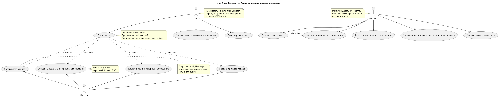
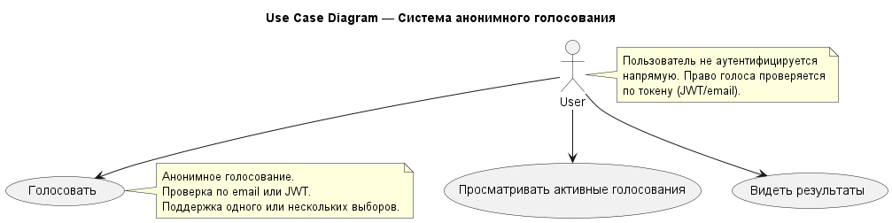
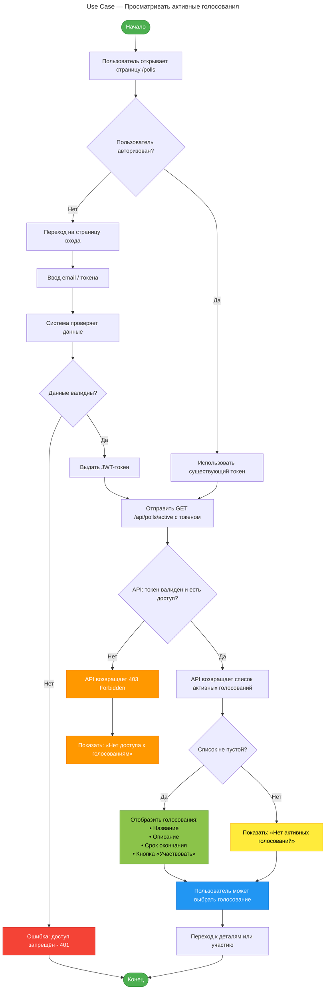
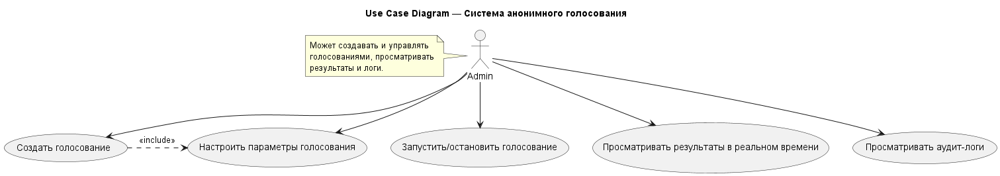
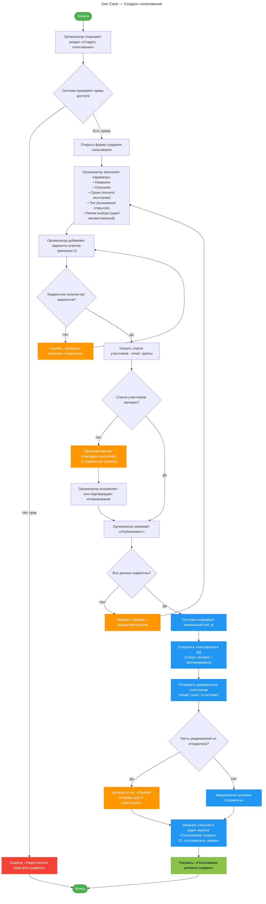
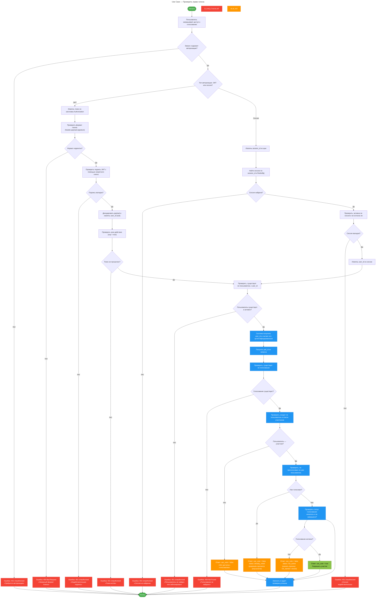

# Модель данных системы голосования

# 1. BPMN диаграмма процесса


# 2. UML диаграммы процесса
## 2.1 Use Case Diagram


[Use Case Model](Models/UML/Use_Case_Model.puml)


### 2.1.1 Для Пользователя (User)
#### 2.1.1.1 Описание

| Номер UC  | Прецедент | Описание |
|-----------|-----------|----------|
| UC1       | Просматривать активные голосования | Пользователь видит список активных голосований, в которых он может участвовать.|
| UC2       | Голосовать        | Пользователь выбирает один или несколько вариантов. Система проверяет право голоса и уникальность.|
| UC3       | Видеть результаты | После голосования или по окончании — пользователь видит итоги (в реальном времени).|


#### 2.1.1.1.1 Описание UC1 - Просматривать активные голосования
🔹 **Название:** Просматривать активные голосования

🔹 **Актор:** Пользователь (участник голосования)

🔹 **Краткое описание:** Пользователь открывает страницу и видит список всех активных голосований, в которых он имеет право участвовать. Каждое голосование отображается с краткой информацией: название, описание, срок окончания, кнопка для перехода к участию.

🔹 **Предусловия:**
* Пользователь имеет участие в одном или нескольких голосованиях (его email/ID в списке участников).
* Голосования находятся в статусе «активно» и не завершены.
* Система доступна, API работает.

🔹 **Основной сценарий:**

| Шаг | Действие |
|--------|----------|
|1 | Пользователь переходит на страницу /polls или нажимает «Активные голосования».|
|2 | Система проверяет наличие и валидность аутентификационного токена (JWT или email-токен).|
|3 | Если токен отсутствует или просрочен — система перенаправляет на страницу входа.|
|4 | При валидном токене система извлекает ID пользователя и его права.|
|5 | Система отправляет запрос к API: GET /api/polls/active, передавая токен.|
|6 | Сервер проверяет токен и определяет, в каких голосованиях пользователь может участвовать.|
|7 | Сервер возвращает список активных голосований, доступных пользователю.|
|8 | Фронтенд отображает список: <br> • Название <br> • Краткое описание <br> • Срок окончания <br> • Кнопка «Участвовать»|
|9 | Пользователь может выбрать любое голосование и перейти к нему.|

🔹 **Альтернативные сценарии:**

A1: Пользователь не авторизован

| Шаг | Действие                                                         |
|---|------------------------------------------------------------------|
| 1 | На шаге 2 токен отсутствует или недействителен.                  |
| 2 | Система перенаправляет на страницу входа (например, ввод email). |
| 3 | Пользователь вводит email → получает одноразовый токен на почту. |
| 4 | После подтверждения — возвращается к шагу 5.                     |

A2: Нет активных голосований

| Шаг | Действие|
|---|---------|
| 1 | Сервер возвращает пустой массив.|
| 2 | Фронтенд отображает сообщение: «Нет активных голосований».|
| 3 | Процесс завершается.|

A3: Доступ запрещён (403)

| Шаг | Действие |
|---|----------|
| 1 | Пользователь авторизован, но не входит в список участников ни одного активного голосования.|
| 2 | Сервер возвращает 403 Forbidden.|
| 3 | Фронтенд показывает: «У вас нет доступа к активным голосованиям».|

A4: Ошибка сервера или таймаут

| Шаг | Действие |
|---|----------|
| 1 | API не отвечает или возвращает 5xx.|
| 2 | Фронтенд показывает: «Не удалось загрузить голосования. Повторите попытку позже».|
| 3 | Предлагается кнопка «Повторить».|

🔹 **Постусловия:**
* Пользователь видит актуальный список голосований.
* Система не раскрывает информацию о других участниках.
* Все действия логируются в аудит-системе (просмотр списка, IP, время).

#### 2.1.1.2 Диаграмма

🔹 Диаграмма прецедента для актора User


🔹 Диаграмма деятельности - Просматривать активные голосования 



### 2.1.2 Для Администратора (Admin)
#### 2.1.2.1 Описание

| Номер UC | Прецедент                                                            | Описание |
|----------|----------------------------------------------------------------------|----------|
| AUC1     | Создать голосование                                                  | Начало процесса создания нового голосования. |
| AUC2     | Настроить параметры голосования                                      | Указать: название, описание, время, варианты ответов, тип (один/несколько). |
| AUC3     | Запустить/остановить голосование                                     | Управление жизненным циклом голосования.                             |
| AUC4     | Просматривать результаты в реальном времени                          | Наблюдение за ходом голосования с обновлением ≤ 4 сек.               |
| AUC5     |Просматривать аудит-логи                    | Просмотр логов голосов (IP, время, метод доступа) для расследования. |


#### Описание AUC1: Создать голосование

🔹 **Название**: Создать голосование

🔹 **Актор:** Организатор (администратор или модератор с правами создания голосований)

🔹 **Краткое описание**: Организатор создаёт новое голосование, указывая его параметры: название, описание, варианты ответов, список участников, сроки, тип голосования (анонимное/открытое), режим подсчёта (один выбор, множественный выбор и т.д.).

🔹 **Предусловия:**
* Организатор авторизован в системе.
* Организатор имеет роль "администратор" или "модератор".
* У системы есть доступ к базе данных и сервисам управления участниками.

🔹 **Основной сценарий**:

| Шаг | Действие                                              |
|-----|-------------------------------------------------------|
| 1   | Организатор переходит в раздел «Создать голосование». |
| 2   | Система проверяет права доступа.                      |
|  3  | Открывается форма создания голосования.               |
| 4 | Организатор заполняет поля:<br> • Название<br> • Описание<br> • Срок начала и окончания<br> • Варианты ответов (минимум 2)<br> • Тип голосования (анонимное / открытое)<br> • Режим выбора (один, несколько)<br> • Способ участия (по email, по ссылке, по токену)|
| 5 | Организатор загружает или указывает список участников (email, группы, роли).|
| 6 | Организатор нажимает «Предварительный просмотр» (опционально).|
| 7 | Организатор нажимает «Опубликовать».|
| 8 | Система валидирует все данные:<br> • Корректность email<br> • Наличие хотя бы двух вариантов<br> • Сроки (начало < окончание)|
| 9 | Система генерирует уникальный poll_id.|
| 10 | Голосование сохраняется в базе данных с статусом «черновик» → «активно» (или «запланировано», если начало в будущем).|
| 11 | Система отправляет уведомления участникам (email, push, сообщение в систему).|
| 12 | Система логирует создание голосования в аудит-журнале.|
| 13 | Отображается сообщение: «Голосование успешно создано».|

🔹 **Альтернативные сценарии:**

A1: Недостаточно прав

| Шаг | Действие |
|----|----------|
|1 | На шаге 2 система определяет, что у пользователя нет прав на создание.|
|2 | Отображается ошибка: «У вас нет прав для создания голосований».|
|3 | Процесс завершается.|

A2: Ошибка валидации формы

| Шаг | Действие |
|-----|----------|
| 1   | На шаге 8 обнаружена ошибка (например, один вариант ответа, пустое название).|
| 2   | Система подсвечивает неверные поля и показывает сообщения об ошибках.|
| 3   | Организатор вносит исправления и повторяет отправку.|

A3: Список участников содержит недействительные email

| Шаг | Действие |
|-----|----------|
| 1   | Система проверяет email и находит недопустимые адреса.|
| 2   | Показывается предупреждение: «Некоторые email некорректны: user@exmple, test».|
| 3   | Организатор может исправить или подтвердить отправку без них.|

A4: Участники не указаны

| Шаг | Действие |
|-----|----------|
|1 | Поле "участники" пустое.|
|2 | Система запрашивает подтверждение: «Голосование не будет отправлено никому. Продолжить?»|
|3 | При подтверждении — голосование создаётся, но уведомления не отправляются.|

A5: Ошибка отправки уведомлений

| Шаг | Действие |
|-----|----------|
| 1   | Часть уведомлений не отправлена (ошибка почтового сервера).|
| 2   | Система логирует ошибку и показывает: «Не все уведомления отправлены. Проверьте журнал».|
| 3   | Голосование считается созданным.|

🔹 **Постусловия:**
* Голосование добавлено в базу данных.
* Участники получили уведомление (если указаны).
* Событие записано в аудит-лог.
* Голосование доступно для просмотра и участия (в зависимости от даты старта).

### 2.1.2.2 Диаграмма

🔹 Диаграмма прецедентов для актора Admin


[ссылка на диаграмму деятельности - Создать голосование](Models/UML/Act_Create_Vote.drawio)

🔹 Диаграмма деятельности - Создать голосование


### 2.1.3 Для Системы (System) — фоновые процессы
#### 2.1.3.1 Описание
| Номер UC | Прецедент | Описание |
|----------|-----------|----------|
| SUC1     | Проверить право голоса                 | Проверка JWT-токена или email-токена на валидность и наличие доступа. |
| SUC2     | Заблокировать повторное голосование    | По user_id и poll_id проверяется, голосовал ли пользователь. |
| SUC3     | Залогировать голос                     | Сохранение технических данных голоса (IP, User-Agent и т.д.) в целях аудита. |
| SUC4     | Обновить результаты в реальном времени | Асинхронное обновление счётчиков и рассылка через WebSocket. |

Описание SUC1: Проверить право голоса
🔹 **Название:**  Проверить право голоса

🔹 **Актор:**
* Пользователь (потенциальный участник голосования)
* Система (автоматически выполняет проверку)

🔹 **Краткое описание:**
Система проверяет, имеет ли пользователь право участвовать в конкретном голосовании на основе его идентификатора (email, ID), активного статуса участника и соответствия условиям голосования (например, членство в группе, роли, приглашение).

🔹 **Предусловия:**
* Пользователь авторизован в системе (имеет валидный JWT, email-токен и т.п.).
* Пользователь пытается получить доступ к голосованию (просмотр, участие).
* Голосование существует и активно (не удалено, не завершено).

🔹 Основной сценарий:

| Шаг | Действие |
|-----|----------|
|1 | Пользователь запрашивает доступ к голосованию (например, открывает /polls/123).|
|2 | Система извлекает ID пользователя из токена или сессии.|
|3 | Система определяет ID голосования из URL или контекста.|
|4 | Система запрашивает данные о голосовании из БД.|
|5 | Система проверяет, существует ли голосование с таким ID.|
|6 | Система проверяет, входит ли пользователь в список участников:<br> • По email<br> • По группе/роли<br> • По приглашению|
|7 | Система проверяет, не проголосовал ли уже пользователь (если голосование однократное).|
|8 | Система проверяет, действует ли голосование сейчас (не просрочено, не в будущем).|
|9 | Все условия выполнены → система возвращает: can_vote: true.|
|10 | Пользователю разрешается просмотр и участие в голосовании.|


🔹 Альтернативные сценарии:

A1: Голосование не существует

| Шаг | Действие |
|-----|----------|
| 1 | На шаге 5 система не находит голосование.|
| 2 | Возвращается ошибка: 404 Not Found.|
| 3 | Процесс завершается.|

A2: Пользователь не в списке участников

| Шаг | Действие |
|-----|----------|
|1 | На шаге 6 система не находит пользователя в списке.|
|2 | Возвращается can_vote: false.|
| 3 | Отображается: «У вас нет доступа к этому голосованию».|

A3: Пользователь уже проголосовал

| Шаг | Действие |
|-----|----------|
|1 | На шаге 7 система обнаруживает запись о голосе.|
|2 | Возвращается can_vote: false, status: already_voted.|
|3 | Пользователю разрешён только просмотр результата (если разрешено).|

A4: Голосование ещё не началось

| Шаг | Действие |
|-----|----------|
| 1 | Текущее время < starts_at.|
| 2 | Возвращается can_vote: false, status: not_started.|
| 3 | Отображается: «Голосование начнётся [дата]».|

A5: Голосование завершено

| Шаг | Действие |
|-----|----------|
| 1 | Текущее время > ends_at.|
|2 | Возвращается can_vote: false, status: closed.|
| 3 | Пользователю показываются итоги, если разрешено.|

A6: Ошибка аутентификации

| Шаг | Действие |
|-----|----------|
| 1 | Токен отсутствует или недействителен.|
| 2 | Возвращается 401 Unauthorized.|
|3 | Требуется повторная авторизация.|

🔹 **Постусловия:**
* Система возвращает однозначный статус доступа: can_vote: true/false.
* Результат используется для отображения интерфейса:
* Кнопка «Проголосовать»
* Сообщение о недоступности
* Просмотр результатов
* Событие логируется в аудит-системе (кто, когда, какое голосование, результат проверки).

### 2.1.3.2 Диаграмма


🔹 Диаграмма деятельности - Проверить право голоса



## 2.2 Sequence diagram
### 2.2.1 Пользователь хочет проголосовать


[Диаграмма в формате UML](Models/UML/Seq_User_Votes.puml)

### 2.2.2 API проверяет право голоса и дубли


[Диаграмма в формате UML](Models/UML/Seq_Check_Vote.puml)

### 2.2.3 API фиксирует голос (асинхронно)


[Диаграмма в формате UML](Models/UML/Seq_API_Vote.puml)

Redis используется для:
Быстрой блокировки повторного голоса (на 10 минут — с запасом)
Мгновенного обновления счётчика в кэше
Rate limiting (например, не более 3 попыток в минуту)

### 2.2.4 Очередь и Worker обрабатывают голос


[Диаграмма в формате UML](Models/UML/Seq_Queue_Vote.puml)

Почему асинхронно?
Чтобы не блокировать пользователя ожиданием записи в БД при высокой нагрузке.

### 2.2.5 Обновление результатов (в реальном времени)


[Диаграмма в формате UML](Models/UML/Seq_Vote_Update.puml)

Задержка:
Redis: < 100 мс
Очередь: < 500 мс
Worker + WS: < 1.5 с
Итого: ≤ 4 сек — требование выполнено

### 2.2.6 Администратор наблюдает за ходом голосования


[Диаграмма в формате UML](Models/UML/Seq_Admin.puml)

# 3. Алгоритм голосования
1. Пользователь получает JWT-токен с правами голоса.
2. Пользователь выбирает варианты ответа и отправляет запрос на голосование.
3. Сервер проверяет права голоса и уникальность голосования.
4. Голос фиксируется в Vote и отправляется в очередь.
5. Worker обновляет PollResultCache и рассылает обновления через WebSocket.
6. Пользователь видит обновлённые результаты.

### 3.1 Sequence Diagram

Общая диаграмма последовательности: 

# 4. Схема базы данных (Сущности и их атрибуты)
## 4.1 User (Пользователь)
### 4.1.1 Краткое описание
Пользователь системы, который может участвовать в голосовании.
### 4.1.2 Атрибуты
| Поле | Тип данных | Описание |
|------|------------|----------|
| id | UUID / BIGINT (PK) | Уникальный идентификатор пользователя |
| email | VARCHAR(255), UNIQUE | Email пользователя (для проверки права голоса) |
| created_at | TIMESTAMP | Дата регистрации |
| last_login | TIMESTAMP | Последний вход (опционально) |
- [x] **Примечание:** Пользователь не аутентифицируется напрямую в системе — доступ проверяется через JWT или email-токен. Хранение email необходимо только для верификации права голоса.

## 4.2 Poll (Голосование)
### 4.2.1 Краткое описание
Описание голосования, которое может быть создано администратором.
### 4.2.2 Атрибуты
| Поле | Тип данных | Описание                                      |
|------|------------|-----------------------------------------------|
| id | UUID / BIGINT (PK) | Уникальный идентификатор голосования          |
| title | VARCHAR(255) | Название голосования                          |
| description | TEXT | Описание голосования                          |
| start_time | TIMESTAMP | Время начала голосования                      |
| end_time | TIMESTAMP | Время окончания голосования                   |
| is_active | BOOLEAN | Активно ли голосование (можно ли голосовать)  |
| allow_multiple_choices | BOOLEAN | Разрешён ли множественный выбор               |
| created_by | UUID (FK → User.id) | Администратор, создавший голосование          |
| created_at | TIMESTAMP | Дата создания                                 |
| updated_at | TIMESTAMP | Дата последнего обновления                    |
- [x] **Примечание:** Голосование может быть одно- или множественным выбором.

## 4.3 Option (Вариант ответа)
### 4.3.1 Краткое описание
Варианты ответов в рамках одного голосования.
### 4.3.2 Атрибуты
| Поле | Тип данных | Описание                                     |
|------|--------|--------------------------------|
| id | UUID (PK) | Уникальный идентификатор варианта ответа |
| poll_id | UUID (FK → Poll.id) | Голосование, к которому относится вариант |
| text | VARCHAR(255) | Текст варианта ответа|
|order|INT|Порядок отображения варианта ответа|
| created_at | TIMESTAMP | Дата создания варианта ответа |

## 4.4 Vote (Голос)
### 4.4.1 Краткое описание
Фиксирует факт голосования пользователем. Анонимный, но проверяемый.
### 4.4.2 Атрибуты
| Поле | Тип данных | Описание                                |
|------|------------|-----------------------------|
| id | UUID (PK) | Уникальный идентификатор голоса |
| poll_id | UUID (FK → Poll.id) | Голосование, к которому относится голос |
| option_id | UUID (FK → Option.id)	 | Выбранный вариант (может быть несколько записей на одно голосование при множественном выборе) |
| user_id | UUID (FK → User.id)	 | Кто проголосовал (для проверки дублей)|
| voted_at | TIMESTAMP | Время голосования |
| client_ip | INET | IP-адрес (для аудита)|
| user_agent | TEXT | User-Agent (для аудита)|
| auth_method | ENUM('email_token', 'jwt') | Способ проверки права голоса|
- [x] **Анонимность:** Пользователь не отображается в результатах. Данные голоса используются только для аудита и не публикуются.


## 4.5 PollResultCache (Кэш результатов)
### 4.5.1 Краткое описание
Для обеспечения обновления результатов в реальном времени (≤ 4 сек).
### 4.5.2 Атрибуты
| Поле | Тип данных | Описание                                |
|------|------------|-----------------------------------------|
| id | UUID (PK) | Уникальный идентификатор записи лога    |
| poll_id | UUID (FK → Poll.id) | Голосование, к которому относится голос |
| option_id | UUID (FK → Option.id) | Выбранный вариант                       |
| user_id | UUID (FK → User.id) | Пользователь, который проголосовал      |
| voted_at | TIMESTAMP | Время голосования                       |
| vote_count | BIGINT | Количество голосов                      |
| updated_at | TIMESTAMP | Время последнего обновления                              |

- [x] **Обновляется асинхронно** через message queue (например, Kafka, RabbitMQ) или stream processing (например, Redis Streams + worker).

ER диаграмма для базы данных:


Ссылка на ER диаграмму: [здесь](https://drawsql.app/teams/inetcoyote/diagrams/vote-platform)

SQL для создания таблиц: [здесь](Models/SQL/Create_Tables.sql)

# 5. Дополнительные компоненты системы
### 5.1 Проверка права голоса
При голосовании пользователь предоставляет:
* JWT-токен с подтверждением can_vote: true и email, или
* Одноразовый токен по email (сгенерированный системой).

Система проверяет:
* Активность голосования (Poll.is_active)
* Не голосовал ли уже пользователь (Vote с таким user_id и poll_id)
* Соответствие email в токене и в User.email

### 5.2 Реальное время (≤ 4 сек задержки)
Использование Redis или in-memory data store для кэширования счётчиков.

После каждого Vote:
* Запись в БД (PostgreSQL)
* Отправка события в очередь (Kafka/RabbitMQ)
* Worker обновляет PollResultCache и рассылает обновления через WebSocket или Server-Sent Events (SSE) подписчикам.

### 5.3 Аудит и безопасность
Все голоса логируются в таблицу Vote.

Логи включают:
* IP, User-Agent, время, метод аутентификации.
* Регулярный экспорт логов в SIEM или WORM-хранилище для защиты от подделки.


# 6. Индексы
### 6.1 Основные индексы (для ускорения поиска)
Пример на SQL:
```
CREATE INDEX idx_vote_poll_user ON Vote(poll_id, user_id); -- Проверка дублей
CREATE INDEX idx_vote_poll_option ON Vote(poll_id, option_id); -- Агрегация голосов
CREATE INDEX idx_poll_active ON Poll(is_active) WHERE is_active = true; -- Активные голосования
CREATE INDEX idx_vote_voted_at ON Vote(voted_at DESC); -- Аудит
```
# 7. Масштабируемость (до 100 000 голосов за 5–10 мин)
**Пиковая нагрузка:** до 100 000 голосов за 300 сек → ~333 голоса/сек.
**Рекомендации:**
* Горизонтальное масштабирование API-серверов (Kubernetes).
* Использование асинхронной записи голосов (через очередь).
* Разделение БД по нагрузке: OLTP (PostgreSQL) + OLAP (ClickHouse для аналитики).
* Redis для rate-limiting и блокировки повторных голосов.

# 8. Обработка ошибок
* **Проверка прав голоса:** Если права не подтверждены, возвращается ошибка 403.
* **Уникальность голосования:** Если пользователь уже голосовал, возвращается ошибка 409.
* **Аудит:** Все ошибки логируются с деталями запроса.
* **Обработка исключений:** Все исключения обрабатываются централизованно и возвращаются клиенту с кодом ошибки.
* **Валидация данных:** Все входящие данные проверяются на корректность.
* **Ограничение скорости:** Реализовано rate-limiting для предотвращения DDoS-атак.
* **Безопасность:** Все запросы проверяются на наличие JWT-токена и соответствие прав.

# 9. Тестирование
* **Unit-тесты:** Для каждого компонента системы.
* **Интеграционные тесты:** Проверка взаимодействия между компонентами.
* **Тестирование нагрузки:** Проверка системы на пиковую нагрузку.
* **Тестирование аудит:** Проверка корректности логирования.
* **Тестирование обработки ошибок:** Проверка корректности обработки исключений.
* **Тестирование валидации данных:** Проверка корректности валидации входящих данных.
* **Тестирование rate-limiting:** Проверка корректности ограничения скорости.
* **Тестирование безопасности:** Проверка корректности проверки прав голоса.
* **Тестирование масштабируемости:** Проверка корректности работы системы при высокой нагрузке.
* **Тестирование реального времени:** Проверка корректности работы системы при реальном времени.
* **Тестирование кэширования:** Проверка корректности работы кэша.
* **Тестирование аудита:** Проверка корректности логирования.

# 10. Архитектурные компоненты
| Компонент         | Технология |   Назначение |
|-------------------|----------|----------|
| Frontend          | React/Vue + WebSocket |   Интерфейс для пользователей и администраторов |
| API Gateway       | Express/NestJS/FastAPI |   Обработка HTTP-запросов, аутентификация |
| Auth Service      | JWT / Email Token |   Проверка права голоса |
| PostgreSQL        | OLTP-база данных |   Хранение голосов, пользователей, голосований |
| Redis             | In-memory store |   Кэш результатов, rate limiting, блокировка дублей |
| Message Queue     | Kafka / RabbitMQ	 |   Асинхронная обработка голосов|
| Worker            | Python/Node.js сервис	 |   Агрегация голосов, обновление кэша, аудит|
| WebSocket Server  | Socket.IO / SSE / Custom |   Рассылка обновлений в реальном времени |
| Audit Log Storage | S3 / ClickHouse / WORM |   Долгосрочное хранение логов аудита |

# 11. Мониторинг и логирование
| Компонент | Технология |   Назначение |
|-----------|----------|----------|
| Prometheus |   Мониторинг метрик |   CPU, RAM, запросы/сек, ошибки |
| Grafana   |   Визуализация метрик |   Графики, алерты |
| ELK Stack |   Логирование и поиск |   Запросы, ошибки, аудиты |
| Sentry    |   Мониторинг ошибок |   Трейсинг, уведомления |
| New Relic |   Мониторинг производительности |   Трейсинг, алерты |
| Datadog   |   Мониторинг метрик |   CPU, RAM, запросы/сек, ошибки |
| Honeycomb |   Мониторинг трафика |   Трейсинг, алерты |

# 12. Безопасность
| Компонент | Технология |   Назначение |
|-----------|----------|----------|
| HTTPS     |   Защита данных в транспорте |   Шифрование соединения |
| JWT       |   Аутентификация |   Безопасный токен доступа |
| OAuth2    |   Авторизация |   Проверка прав доступа |
| CORS      |   Защита от XSS |   Разрешение запросов с других доменов |
| CSRF      |   Защита от CSRF |   Защита от межсайтовой подделки запроса |
| XSS       |   Защита от XSS |   Защита от межсайтового скриптинга |
| SQLi      |   Защита от SQL-инъекций |   Защита от инъекций SQL |
| Rate Limiting |   Защита от DDoS |   Ограничение скорости запросов |
| Audit Logs |   Защита от подделки |   Логирование всех действий |
| WORM Storage |   Защита от подделки |   Долгосрочное хранение логов |

# 13. Swagger

| Эндпоинт | Описание | Swagger                                                                     |
|-----------|---------|--------------------------------|
| GET /polls/active   | возвращает массив активных опросов    | [Get_Pools - получение списка голосований](Models/Swagger/Get_Pools.yaml)   |
| POST /api/vote   | отправка голоса пользователя в опросе | [Post_Vote - отправка голоса](Models/Swagger/Post_Vote.yaml)                |

[Пример JSON ответа с перечнем возможных голосований](Models/JSON/Vote_Response.json)

[Пример JSON ответа с результатами голосования](Models/JSON/Vote_Results.json)

<!--
# 13. Документация
| Компонент | Технология |   Назначение |
|-----------|----------|----------|
| Swagger   |   API документация |   Описание всех API-методов |
| OpenAPI   |   API документация |   Описание всех API-методов |
| Postman   |   API тестирование |   Тестирование всех API-методов |
| Confluence|   Документация |   Описание архитектуры, процессов |
| Jira      |   Управление задачами |   Управление задачами |
| Trello    |   Управление задачами |   Управление задачами |
| Slack     |   Общение |   Общение между командами |
| Telegram  |   Общение |   Общение между командами |
| WhatsApp  |   Общение |   Общение между командами |
| Email     |   Общение |   Общение между командами |
| Phone     |   Общение |   Общение между командами |
| Video     |   Общение |   Общение между командами |
| Audio     |   Общение |   Общение между командами |
| Chat      |   Общение |   Общение между командами |
| Forum     |   Общение |   Общение между командами |

# 13. CI/CD
| Компонент | Технология |   Назначение |
|-----------|----------|----------|
| GitHub Actions |   CI/CD |   Автоматизация сборки и тестирования |
| Jenkins   |   CI/CD |   Автоматизация сборки и тестирования |
| GitLab CI |   CI/CD |   Автоматизация сборки и тестирования |
| CircleCI  |   CI/CD |   Автоматизация сборки и тестирования |
| Travis CI |   CI/CD |   Автоматизация сборки и тестирования |
| Git       |   Ветвление и слияние |   Управление версиями кода |
| Docker    |   Контейнеризация |   Пакетное развертывание приложений |
| Kubernetes|   Оркестрация контейнеров |   Автоматизация развертывания и масштабирования |
| Helm      |   Пакетный менеджер для Kubernetes |   Управление конфигурацией приложений |
| Terraform |   Инфраструктура как код |   Управление инфраструктурой |
| Ansible   |   Автоматизация конфигурации |   Управление конфигурацией серверов |
| Prometheus|   Мониторинг метрик |   Мониторинг производительности |
| Grafana   |   Визуализация метрик |   Визуализация метрик |
| ELK Stack |   Логирование и поиск |   Логирование и поиск |
| Sentry    |   Мониторинг ошибок |   Мониторинг ошибок |
| New Relic |   Мониторинг производительности |   Мониторинг производительности |
| Datadog   |   Мониторинг метрик |   Мониторинг метрик |
| Honeycomb |   Мониторинг трафика |   Мониторинг трафика |
-->
